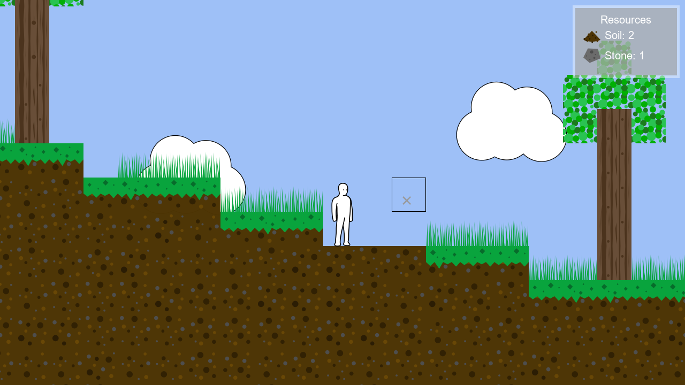

# Endless Tiles
2D sandbox tile-based game concept with endless terrain generation. I made this to learn about terrain generation as well as to try out an idea I had for an endless open world in 2 dimensions. The tiles are grouped into chunks of 64 by 64. Whenever the player moves out of the range of nearby chunks, new chunks are created and joined together in a "mesh" of chunks, similar to a linked list but in 2D. You can press "M" to view the chunk mesh. The red squares are chunks that have not been generated yet in the chunk grid.

The controls are WASD keys to move, Left click to place a tile and hold Right click to destroy a tile. Esc to pause.

Feel free to use any part of this project for your own projects, including the SVGs. Credit to Stefan Gustavson for his implementation of a simplex noise algorithm which was used for terrain generation.

For now the Makefile only works on Linux distributions, however I may update this to build for Windows too.


## **Install dependencies:**
Arch:
```
# pacman -S base-devel
# pacman -S sdl2 sdl2_image sdl2_ttf
```

Debian/Ubuntu:
```
# apt install build-essential
# apt install libsdl2-dev libsdl2-image-dev libsdl2-ttf-dev
```


## **Compile and run:**
```
$ make
$ ./game
```


## **Preview:**

